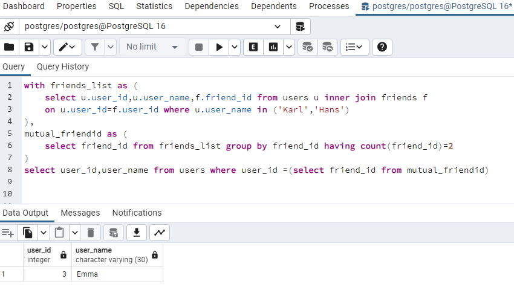

******Problem Statement :******

Google (Medium Level) SQL Interview Question — Solution
You are analyzing a social network dataset at Google. 
Your task is to find mutual friends between two users, Karl and Hans. There is only one user named Karl and one named Hans in the dataset.
The output should contain 'user_id' and 'user_name' columns.

******Schema and Dataset :******

CREATE TABLE users(user_id INT, user_name varchar(30));
INSERT INTO users VALUES (1, 'Karl'), (2, 'Hans'), (3, 'Emma'), (4, 'Emma'), (5, 'Mike'), (6, 'Lucas'), (7, 'Sarah'), (8, 'Lucas'), 
(9, 'Anna'), (10, 'John');

CREATE TABLE friends(user_id INT, friend_id INT);
INSERT INTO friends VALUES (1,3),(1,5),(2,3),(2,4),(3,1),(3,2),(3,6),(4,7),(5,8),(6,9),(7,10),(8,6),(9,10),(10,7),(10,9);

******Solution :******

1. First i have used the inner join to get the records only for  karl and hans
2. As we are finding mutual friends for 2 people  so the count we will get 2 . hence from the output of above whose  friend id has value 2 that person will be the mutual friend.
   if we are finding for example 3 we have to increase count(friend_id) to 3 etc.
3. based on that id we can retrieve the name of that person from users table

******Query :******

with friends_list as (
	select u.user_id,u.user_name,f.friend_id from users u inner join friends f
	on u.user_id=f.user_id where u.user_name in ('Karl','Hans')
),
mutual_friendid as (
	select friend_id from friends_list group by friend_id having count(friend_id)=2
)
select user_id,user_name from users where user_id =(select friend_id from mutual_friendid)

******Output :******

