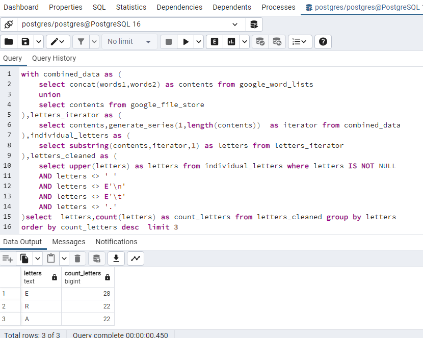

******Problem Statement :******

Google (Hard Level) SQL Interview Question — Solution

Find the top 3 most common letters across all the words from both the tables (ignore filename column). 
Output the letter along with the number of occurrences and order records in descending order based on the number of occurrences.

******Schema and Dataset :******
```sql
CREATE TABLE google_file_store (contents VARCHAR, filename VARCHAR(255));

INSERT INTO google_file_store (contents, filename) VALUES 
('This is a sample content with some words.', 'file1.txt'), 
('Another file with more words and letters.', 'file2.txt'), 
('Text for testing purposes with various characters.', 'file3.txt');

CREATE TABLE google_word_lists ( words1 VARCHAR, words2 VARCHAR);

INSERT INTO google_word_lists (words1, words2) VALUES 
('apple banana cherry', 'dog elephant fox'), 
('grape honeydew kiwi', 'lemon mango nectarine'), 
('orange papaya quince', 'raspberry strawberry tangerine');
```
******Solution :******

1. comnibed the data from both tables
2. generated series for the data till its length
3. used substring to get the single letter 
4. removed unnecssary things
5. counted each individual letters 

******Query :******
```SQL
with combined_data as (
	select concat(words1,words2) as contents from google_word_lists
	union 
	select contents from google_file_store
),
letters_iterator as (
	select contents,generate_series(1,length(contents))  as iterator from combined_data
),
individual_letters as (
	select substring(contents,iterator,1) as letters from letters_iterator
),
letters_cleaned as (
	select upper(letters) as letters from individual_letters where letters IS NOT NULL 
	AND letters <> ' '  
	AND letters <> E'\n' 
	AND letters <> E'\t'
	AND letters <> '.'
) 
select  letters,count(letters) as count_letters from letters_cleaned group by letters
order by count_letters desc  limit 3

```
******Output :******


