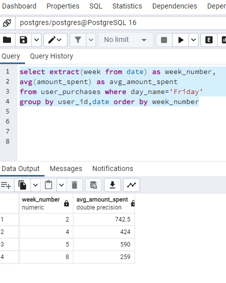

******Problem Statement :******

IBM(Hard Level) SQL Interview Question — Solution

IBM is working on a new feature to analyze user purchasing behavior for all Fridays in the first quarter of the year. 
For each Friday separately, calculate the average amount users have spent per order. 
The output should contain the week number of that Friday and average amount spent.

******Schema and Dataset :******
```sql
CREATE TABLE user_purchases(user_id int, date date, amount_spent float, day_name varchar(15));

INSERT INTO user_purchases VALUES
(1047,'2023-01-01',288,'Sunday'),
(1099,'2023-01-04',803,'Wednesday'),
(1055,'2023-01-07',546,'Saturday'),
(1040,'2023-01-10',680,'Tuesday'),
(1052,'2023-01-13',889,'Friday'),
(1052,'2023-01-13',596,'Friday'),
(1016,'2023-01-16',960,'Monday'),
(1023,'2023-01-17',861,'Tuesday'),
(1010,'2023-01-19',758,'Thursday'),
(1013,'2023-01-19',346,'Thursday'),
(1069,'2023-01-21',541,'Saturday'),
(1030,'2023-01-22',175,'Sunday'),
(1034,'2023-01-23',707,'Monday'),
(1019,'2023-01-25',253,'Wednesday'),
(1052,'2023-01-25',868,'Wednesday'),
(1095,'2023-01-27',424,'Friday'),
(1017,'2023-01-28',755,'Saturday'),
(1010,'2023-01-29',615,'Sunday'),
(1063,'2023-01-31',534,'Tuesday'),
(1019,'2023-02-03',185,'Friday'),
(1019,'2023-02-03',995,'Friday'),
(1092,'2023-02-06',796,'Monday'),
(1058,'2023-02-09',384,'Thursday'),
(1055,'2023-02-12',319,'Sunday'),
(1090,'2023-02-15',168,'Wednesday'),
(1090,'2023-02-18',146,'Saturday'),
(1062,'2023-02-21',193,'Tuesday'),
(1023,'2023-02-24',259,'Friday');
```
******Solution :******

1. get the records for friday
2. group the data on date and id 

******Query :******
```sql
select extract(week from date) as week_number,
avg(amount_spent) as avg_amount_spent
from user_purchases where day_name='Friday'
group by user_id,date order by week_number
```

******Output :******




